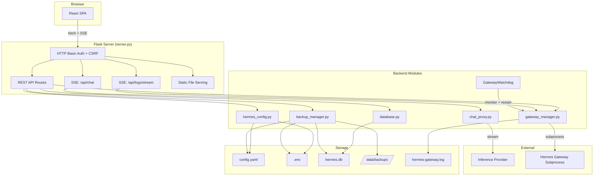

# Hermes UI Upgrade — System Architecture

> **Status:** Draft  
> **Author:** Architect Agent  
> **Date:** 2026-04-13  
> **Scope:** Full-stack upgrade from vanilla admin panel to React SPA with chat, backups, auto-restart, and real-time logs.

---

## 1. Directory Structure

```
hermes/
├── server.py                      # Flask app — routes, SSE, auth (expanded)
├── gateway_manager.py             # Subprocess manager (+ watchdog thread)
├── hermes_config.py               # Config/env persistence (unchanged interface)
├── database.py                    # NEW — SQLite schema, migrations, queries
├── backup_manager.py              # NEW — backup/restore orchestration
├── chat_proxy.py                  # NEW — streaming proxy to inference providers
├── requirements.txt               # Updated with new deps
├── Dockerfile                     # Updated for frontend build stage
├── docker-compose.yml
├── railway.toml
├── start.sh
├── frontend/                      # NEW — React SPA (Vite + TypeScript)
│   ├── package.json
│   ├── vite.config.ts
│   ├── tsconfig.json
│   ├── index.html
│   ├── public/
│   └── src/
│       ├── main.tsx
│       ├── App.tsx
│       ├── api/                   # API client + types
│       │   ├── client.ts
│       │   ├── types.ts
│       │   └── sse.ts
│       ├── hooks/                 # Shared React hooks
│       │   ├── useStatus.ts
│       │   ├── useSSE.ts
│       │   └── useChat.ts
│       ├── pages/                 # Top-level page components
│       │   ├── DashboardPage.tsx
│       │   ├── ChatPage.tsx
│       │   ├── ConfigPage.tsx
│       │   ├── LogsPage.tsx
│       │   └── BackupsPage.tsx
│       ├── components/            # Reusable UI components
│       │   ├── layout/
│       │   │   ├── AppShell.tsx
│       │   │   ├── Sidebar.tsx
│       │   │   └── Header.tsx
│       │   ├── dashboard/
│       │   │   ├── GatewayStatus.tsx
│       │   │   ├── SetupChecklist.tsx
│       │   │   └── QuickActions.tsx
│       │   ├── chat/
│       │   │   ├── ChatContainer.tsx
│       │   │   ├── MessageBubble.tsx
│       │   │   ├── ChatInput.tsx
│       │   │   ├── ConversationList.tsx
│       │   │   └── ModelSelector.tsx
│       │   ├── config/
│       │   │   ├── ProviderForm.tsx
│       │   │   ├── ConfigYamlEditor.tsx
│       │   │   ├── EnvEditor.tsx
│       │   │   └── ModelBrowser.tsx
│       │   ├── logs/
│       │   │   ├── LogStream.tsx
│       │   │   └── LogControls.tsx
│       │   ├── backups/
│       │   │   ├── BackupList.tsx
│       │   │   └── RestoreDialog.tsx
│       │   └── shared/
│       │       ├── Pill.tsx
│       │       ├── Button.tsx
│       │       ├── Dialog.tsx
│       │       └── Toast.tsx
│       └── styles/
│           └── index.css
├── static/                        # LEGACY — preserved during migration
│   ├── app.css
│   └── app.js
├── templates/                     # LEGACY — preserved during migration
│   └── index.html
└── .github/
    └── tasks/
        └── architecture.md        # This file
```

### Key Decisions

- **`frontend/`** is a standard Vite project. Build output (`frontend/dist/`) is served by Flask as a static folder. It is gitignored; the Dockerfile builds it in a multi-stage step.
- **New Python modules** (`database.py`, `backup_manager.py`, `chat_proxy.py`) are top-level alongside existing modules — no package restructuring needed.
- **Legacy `static/` and `templates/`** remain functional throughout migration so the old UI keeps working until the React SPA is complete. A single Flask flag switches which UI is served.

---

## 2. Backend API Design

All routes are prefixed as shown. Every write route requires HTTP Basic Auth + same-origin JSON policy (existing `require_basic_auth` + `require_same_origin_json_write` middleware).

### 2.1 Existing Routes (Preserved)

| Method | Path | Purpose |
|--------|------|---------|
| `GET` | `/health` | Public health check (no auth) |
| `GET` | `/api/status` | Gateway + config status |
| `POST` | `/api/config` | Save provider config |
| `POST` | `/api/gateway/<action>` | start / stop / restart |
| `POST` | `/api/test-connection` | Probe inference endpoint |

### 2.2 New Routes — SPA Serving

| Method | Path | Purpose |
|--------|------|---------|
| `GET` | `/` | Serve React SPA `index.html` from `frontend/dist/` |
| `GET` | `/assets/<path>` | Serve Vite build assets (JS/CSS chunks) |
| `GET` | `/<path:fallback>` | SPA fallback — serve `index.html` for client-side routing |

**Implementation:** Flask `send_from_directory` pointing at `frontend/dist/`. A `USE_LEGACY_UI` env var (default `false`) switches to the old Jinja2 template during migration.

```python
FRONTEND_DIR = Path(__file__).parent / "frontend" / "dist"
USE_LEGACY_UI = os.getenv("USE_LEGACY_UI", "false").lower() in {"1", "true", "yes"}

@APP.get("/")
def index():
    if USE_LEGACY_UI:
        return render_template("index.html", ...)
    return send_from_directory(FRONTEND_DIR, "index.html")
```

### 2.3 New Routes — Chat

| Method | Path | Purpose | Request | Response |
|--------|------|---------|---------|----------|
| `POST` | `/api/chat` | Send message, get streamed response | `ChatRequest` | SSE stream |
| `GET` | `/api/conversations` | List conversations | query: `?limit=50&offset=0` | `ConversationList` |
| `GET` | `/api/conversations/<id>` | Get full conversation | — | `Conversation` |
| `POST` | `/api/conversations` | Create new conversation | `{title?: string}` | `Conversation` |
| `DELETE` | `/api/conversations/<id>` | Delete conversation | — | `{ok: true}` |
| `PATCH` | `/api/conversations/<id>` | Rename conversation | `{title: string}` | `Conversation` |

#### Chat Request Schema

```json
{
  "conversation_id": "uuid-string",
  "message": "Hello, what can you do?",
  "model": "llama3.2",
  "system_prompt": "You are a helpful assistant."
}
```

#### Chat SSE Stream Format

Each SSE event follows the OpenAI streaming convention:

```
event: delta
data: {"content": "Hello", "conversation_id": "...", "message_id": "..."}

event: delta
data: {"content": "! I", "conversation_id": "...", "message_id": "..."}

event: done
data: {"conversation_id": "...", "message_id": "...", "usage": {"prompt_tokens": 12, "completion_tokens": 45}}

event: error
data: {"error": "Connection to provider failed.", "code": "provider_error"}
```

### 2.4 New Routes — Config Management (Extended)

| Method | Path | Purpose | Request | Response |
|--------|------|---------|---------|----------|
| `GET` | `/api/config/yaml` | Read raw config.yaml | — | `{content: string}` |
| `PUT` | `/api/config/yaml` | Write raw config.yaml | `{content: string}` | `{ok: true}` |
| `GET` | `/api/config/env` | Read .env (keys visible, secrets masked) | — | `{entries: [{key, value, masked}]}` |
| `PUT` | `/api/config/env` | Write .env entries | `{entries: [{key, value}]}` | `{ok: true}` |
| `GET` | `/api/models` | List models from active provider | — | `{models: [{id, name, context_length?}]}` |
| `GET` | `/api/providers` | List available providers | — | `{providers: [{id, label, configured}]}` |

#### Config YAML PUT Validation

The `PUT /api/config/yaml` endpoint YAML-parses the body to reject invalid YAML before writing. Returns `400` with a parse error message on failure.

#### Env Masking

`GET /api/config/env` returns all keys but masks values for keys matching `*KEY*`, `*SECRET*`, `*TOKEN*`, `*PASSWORD*` patterns (same `mask_secret` logic as existing).

### 2.5 New Routes — Backups

| Method | Path | Purpose | Request | Response |
|--------|------|---------|---------|----------|
| `GET` | `/api/backups` | List all backups | — | `{backups: [BackupMeta]}` |
| `POST` | `/api/backups` | Create a backup | `{label?: string}` | `BackupMeta` |
| `POST` | `/api/backups/<id>/restore` | Restore a backup | `{restart_gateway?: bool}` | `{ok: true, restored: BackupMeta}` |
| `DELETE` | `/api/backups/<id>` | Delete a backup | — | `{ok: true}` |
| `GET` | `/api/backups/<id>/download` | Download backup as tar.gz | — | `application/gzip` binary |

#### BackupMeta Schema

```json
{
  "id": "20260413T143022Z",
  "label": "Before model switch",
  "created_at": "2026-04-13T14:30:22Z",
  "size_bytes": 4096,
  "files": ["config.yaml", ".env", "hermes.db"]
}
```

### 2.6 New Routes — Logs (SSE)

| Method | Path | Purpose | Response |
|--------|------|---------|----------|
| `GET` | `/api/logs/stream` | SSE live log stream | SSE event stream |
| `GET` | `/api/logs/history` | Fetch historical log lines | `{lines: string[], total: int}` |

#### Log SSE Format

```
event: log
data: {"line": "[2026-04-13 14:30:22] Gateway started.", "level": "info"}

event: log
data: {"line": "[2026-04-13 14:30:23] Request processed.", "level": "info"}
```

### 2.7 New Routes — Gateway Watchdog Config

| Method | Path | Purpose | Request | Response |
|--------|------|---------|---------|----------|
| `GET` | `/api/gateway/watchdog` | Get auto-restart policy | — | `WatchdogPolicy` |
| `PUT` | `/api/gateway/watchdog` | Update auto-restart policy | `WatchdogPolicy` | `WatchdogPolicy` |

#### WatchdogPolicy Schema

```json
{
  "enabled": true,
  "max_retries": 5,
  "backoff_base_seconds": 2,
  "backoff_max_seconds": 60,
  "cooldown_seconds": 300,
  "notify_on_restart": true
}
```

---

## 3. Frontend Component Tree

```
App
├── AppShell                          # Sidebar + header + content area
│   ├── Sidebar                       # Navigation: Dashboard, Chat, Config, Logs, Backups
│   └── Header                        # Title, gateway pill status, auth indicator
│
├── DashboardPage                     # Landing page (replaces current index.html)
│   ├── GatewayStatus                 # Running/stopped pill, PID, uptime
│   ├── SetupChecklist                # Provider → Model → Endpoint → Connection → Gateway
│   └── QuickActions                  # Start/Stop/Restart buttons, Save & Restart
│
├── ChatPage                          # WebChat interface
│   ├── ConversationList              # Sidebar list of past conversations
│   │   └── (conversation items)
│   ├── ChatContainer                 # Message thread
│   │   └── MessageBubble             # User/assistant message with markdown rendering
│   ├── ChatInput                     # Textarea + send button + model selector
│   └── ModelSelector                 # Dropdown populated from /api/models
│
├── ConfigPage                        # Full configuration management
│   ├── ProviderForm                  # Provider select, model, keys (from current UI)
│   ├── ConfigYamlEditor              # Raw YAML editor with syntax highlighting
│   ├── EnvEditor                     # Key-value .env editor with masked secrets
│   └── ModelBrowser                  # Grid of available models from provider
│
├── LogsPage                          # Real-time gateway logs
│   ├── LogControls                   # Auto-scroll toggle, clear, filter input
│   └── LogStream                     # Virtualized log line list (SSE-fed)
│
└── BackupsPage                       # Backup management
    ├── BackupList                    # Table of backups with restore/delete/download
    └── RestoreDialog                 # Confirmation dialog before restore
```

### Routing

| Path | Component | Description |
|------|-----------|-------------|
| `/` | `DashboardPage` | Gateway status + quick actions |
| `/chat` | `ChatPage` | Chat interface |
| `/chat/:conversationId` | `ChatPage` | Chat with specific conversation loaded |
| `/config` | `ConfigPage` | Provider + YAML + env management |
| `/logs` | `LogsPage` | Live log stream |
| `/backups` | `BackupsPage` | Backup/restore management |

Client-side routing via `react-router-dom`. Flask SPA fallback catches all unmatched GET routes and serves `index.html`.

### Frontend Dependencies

```json
{
  "dependencies": {
    "react": "^19.0.0",
    "react-dom": "^19.0.0",
    "react-router-dom": "^7.0.0",
    "react-markdown": "^10.0.0",
    "highlight.js": "^11.0.0"
  },
  "devDependencies": {
    "@vitejs/plugin-react": "^4.0.0",
    "vite": "^6.0.0",
    "typescript": "^5.7.0",
    "@types/react": "^19.0.0",
    "@types/react-dom": "^19.0.0"
  }
}
```

No CSS framework — keep the existing paper/warm aesthetic from `app.css` ported to CSS modules or a single stylesheet. Reuse the existing `:root` custom properties.

---

## 4. Data Models — SQLite Schema

Database file: `/data/hermes.db`  
Managed by: `database.py`  
Schema migrations: version-tracked with a `schema_version` pragma.

### 4.1 Conversations

```sql
CREATE TABLE conversations (
    id          TEXT PRIMARY KEY,   -- UUID v4
    title       TEXT NOT NULL DEFAULT 'New Conversation',
    model       TEXT NOT NULL,
    system_prompt TEXT NOT NULL DEFAULT '',
    created_at  TEXT NOT NULL DEFAULT (strftime('%Y-%m-%dT%H:%M:%SZ', 'now')),
    updated_at  TEXT NOT NULL DEFAULT (strftime('%Y-%m-%dT%H:%M:%SZ', 'now'))
);

CREATE INDEX idx_conversations_updated ON conversations(updated_at DESC);
```

### 4.2 Messages

```sql
CREATE TABLE messages (
    id              TEXT PRIMARY KEY,   -- UUID v4
    conversation_id TEXT NOT NULL REFERENCES conversations(id) ON DELETE CASCADE,
    role            TEXT NOT NULL CHECK (role IN ('user', 'assistant', 'system')),
    content         TEXT NOT NULL,
    model           TEXT,               -- model used for assistant messages
    prompt_tokens   INTEGER,
    completion_tokens INTEGER,
    created_at      TEXT NOT NULL DEFAULT (strftime('%Y-%m-%dT%H:%M:%SZ', 'now'))
);

CREATE INDEX idx_messages_conversation ON messages(conversation_id, created_at ASC);
```

### 4.3 Backups Metadata

```sql
CREATE TABLE backups (
    id          TEXT PRIMARY KEY,   -- timestamp-based: 20260413T143022Z
    label       TEXT NOT NULL DEFAULT '',
    files       TEXT NOT NULL,      -- JSON array of filenames included
    size_bytes  INTEGER NOT NULL DEFAULT 0,
    created_at  TEXT NOT NULL DEFAULT (strftime('%Y-%m-%dT%H:%M:%SZ', 'now'))
);
```

### 4.4 Watchdog State

```sql
CREATE TABLE watchdog_config (
    id                      INTEGER PRIMARY KEY CHECK (id = 1),  -- singleton row
    enabled                 INTEGER NOT NULL DEFAULT 1,
    max_retries             INTEGER NOT NULL DEFAULT 5,
    backoff_base_seconds    REAL NOT NULL DEFAULT 2.0,
    backoff_max_seconds     REAL NOT NULL DEFAULT 60.0,
    cooldown_seconds        REAL NOT NULL DEFAULT 300.0,
    notify_on_restart       INTEGER NOT NULL DEFAULT 1
);

-- Seed the singleton on first migration
INSERT OR IGNORE INTO watchdog_config (id) VALUES (1);
```

### 4.5 Schema Version Tracking

```python
# database.py
SCHEMA_VERSION = 1

def migrate(conn: sqlite3.Connection) -> None:
    current = conn.execute("PRAGMA user_version").fetchone()[0]
    if current < 1:
        conn.executescript(SCHEMA_V1)
        conn.execute(f"PRAGMA user_version = {SCHEMA_VERSION}")
```

### 4.6 database.py Public Interface

```python
def get_db() -> sqlite3.Connection:
    """Return a thread-local SQLite connection with WAL mode."""

def init_db() -> None:
    """Run migrations at startup."""

# Conversations
def create_conversation(title: str, model: str, system_prompt: str) -> dict
def get_conversation(conversation_id: str) -> dict | None
def list_conversations(limit: int, offset: int) -> list[dict]
def update_conversation(conversation_id: str, title: str) -> dict
def delete_conversation(conversation_id: str) -> None

# Messages
def add_message(conversation_id: str, role: str, content: str, ...) -> dict
def get_messages(conversation_id: str) -> list[dict]

# Watchdog
def get_watchdog_config() -> dict
def set_watchdog_config(**kwargs) -> dict
```

---

## 5. Gateway Auto-Restart Design

### 5.1 Watchdog Thread

The watchdog runs as a daemon thread inside `GatewayManager`, started by `bootstrap()`. It monitors the subprocess and applies the retry policy from `watchdog_config`.

```
┌──────────────┐    polls every 2s     ┌──────────────────┐
│   Watchdog   │ ────────────────────▶  │  Gateway Process │
│   Thread     │                        │  (subprocess)    │
│              │ ◀── exit detected ───  │                  │
│  reads policy│                        └──────────────────┘
│  from SQLite │
│              │ ──── restart ────────▶ GatewayManager.start()
└──────────────┘
```

### 5.2 Retry Logic (Pseudocode)

```python
class GatewayWatchdog:
    def __init__(self, manager: GatewayManager):
        self._manager = manager
        self._consecutive_failures = 0
        self._last_restart_at = 0.0
        self._thread = threading.Thread(target=self._run, daemon=True)

    def start(self):
        self._thread.start()

    def _run(self):
        while True:
            time.sleep(2)
            policy = get_watchdog_config()  # from database.py
            if not policy["enabled"]:
                self._consecutive_failures = 0
                continue
            if not self._manager.is_running() and self._should_restart(policy):
                self._do_restart(policy)

    def _should_restart(self, policy: dict) -> bool:
        if self._consecutive_failures >= policy["max_retries"]:
            return False  # exhausted retries
        # Check cooldown: if we've been restarting for a while, wait
        elapsed = time.time() - self._last_restart_at
        backoff = min(
            policy["backoff_base_seconds"] * (2 ** self._consecutive_failures),
            policy["backoff_max_seconds"],
        )
        return elapsed >= backoff

    def _do_restart(self, policy: dict):
        self._consecutive_failures += 1
        self._last_restart_at = time.time()
        self._manager.start()
        # Log the auto-restart event
```

### 5.3 Cooldown Reset

The consecutive failure counter resets when:
- The gateway has been running continuously for longer than `cooldown_seconds`.
- The user manually starts/restarts.
- The watchdog policy is updated.

### 5.4 Integration with GatewayManager

```python
# In gateway_manager.py — additions
class GatewayManager:
    def __init__(self):
        # ... existing init ...
        self.watchdog = GatewayWatchdog(self)

    def start(self):
        # ... existing start logic ...
        self.watchdog.reset_failures()  # manual start clears counter
        return self.status()
```

---

## 6. Backup System Design

### 6.1 What Gets Backed Up

| File | Path | Always Included |
|------|------|-----------------|
| `config.yaml` | `HERMES_HOME/config.yaml` | Yes |
| `.env` | `HERMES_HOME/.env` | Yes |
| `hermes.db` | `DATA_DIR/hermes.db` | Yes (if exists) |
| `hermes-gateway.log` | `DATA_DIR/hermes-gateway.log` | No (optional, large) |

### 6.2 Storage

Backups stored at: `DATA_DIR/backups/<id>/`  
Each backup is a directory containing copies of the backed-up files plus a `manifest.json`.

```
/data/backups/
├── 20260413T143022Z/
│   ├── manifest.json
│   ├── config.yaml
│   ├── .env
│   └── hermes.db
└── 20260414T090000Z/
    ├── manifest.json
    ├── config.yaml
    └── .env
```

### 6.3 backup_manager.py Public Interface

```python
BACKUP_DIR = DATA_DIR / "backups"
MAX_BACKUPS = 20  # auto-prune oldest beyond this

def create_backup(label: str = "") -> dict:
    """Copy current config files + DB into a timestamped backup directory."""

def list_backups() -> list[dict]:
    """List all backup metadata, newest first."""

def get_backup(backup_id: str) -> dict | None:
    """Return metadata for a single backup."""

def restore_backup(backup_id: str) -> dict:
    """Overwrite current files with backup contents. Returns restored metadata."""

def delete_backup(backup_id: str) -> None:
    """Remove a backup directory."""

def download_backup(backup_id: str) -> Path:
    """Create a temporary tar.gz of the backup for download."""
```

### 6.4 Restore Flow

```
User clicks "Restore" in UI
        │
        ▼
POST /api/backups/<id>/restore  {restart_gateway: true}
        │
        ▼
backup_manager.restore_backup(id)
  ├── Validate backup exists + files are intact
  ├── Auto-create a "pre-restore" backup (safety net)
  ├── Copy config.yaml → HERMES_HOME/config.yaml
  ├── Copy .env → HERMES_HOME/.env
  ├── Copy hermes.db → DATA_DIR/hermes.db (if present in backup)
  └── Return success
        │
        ▼
If restart_gateway=true:
  └── GATEWAY.restart()
        │
        ▼
Return 200 {ok: true, restored: BackupMeta}
```

### 6.5 Auto-Pruning

When `create_backup` produces more than `MAX_BACKUPS`, the oldest backups are deleted. This prevents disk exhaustion in long-running deployments.

---

## 7. Chat Streaming Design

### 7.1 Architecture

```
┌──────────┐   POST /api/chat    ┌─────────────┐   POST /v1/chat/completions   ┌──────────────┐
│  React   │ ─────────────────▶  │  Flask       │ ─────────────────────────────▶│  Inference   │
│  ChatPage│                     │  chat_proxy  │                               │  Provider    │
│          │ ◀── SSE stream ───  │              │ ◀── SSE stream ──────────────│  (Ollama/OR) │
└──────────┘                     └─────────────┘                               └──────────────┘
                                       │
                                       ▼
                                 ┌─────────────┐
                                 │  SQLite DB   │
                                 │  (messages)  │
                                 └─────────────┘
```

### 7.2 chat_proxy.py — Streaming Proxy

```python
def stream_chat(
    base_url: str,
    api_key: str | None,
    model: str,
    messages: list[dict],
) -> Generator[str, None, dict]:
    """
    Open a streaming connection to the inference provider and yield SSE lines.
    Returns final usage stats after the generator is exhausted.

    Uses urllib (stdlib) to POST to /v1/chat/completions with stream=true,
    reads the chunked response line by line, and yields formatted SSE events.
    """
```

### 7.3 Flask Endpoint

```python
@APP.post("/api/chat")
def api_chat():
    payload = request.get_json()
    conversation_id = payload["conversation_id"]
    user_message = payload["message"]
    model = payload.get("model") or load_settings().default_model

    # 1. Persist user message
    add_message(conversation_id, "user", user_message)

    # 2. Load conversation history for context
    messages = get_messages(conversation_id)

    # 3. Resolve provider endpoint
    settings = load_settings()
    base_url, api_key = resolve_provider(settings)

    # 4. Stream response
    def generate():
        full_content = []
        usage = {}
        try:
            for event in stream_chat(base_url, api_key, model, messages):
                yield event
                # accumulate content for DB persistence
            # 5. Persist complete assistant message
            add_message(conversation_id, "assistant", "".join(full_content), ...)
        except Exception as exc:
            yield f"event: error\ndata: {json.dumps({'error': str(exc)})}\n\n"

    return Response(
        generate(),
        content_type="text/event-stream",
        headers={
            "Cache-Control": "no-cache",
            "X-Accel-Buffering": "no",
        },
    )
```

### 7.4 Provider Resolution

```python
def resolve_provider(settings: HermesSettings) -> tuple[str, str | None]:
    """Return (base_url, api_key) for the active provider."""
    provider = normalize_provider(settings.provider)
    if provider == "custom":
        return settings.ollama_base_url, settings.ollama_api_key or None
    if provider == "openrouter":
        return DEFAULT_OPENROUTER_BASE_URL, settings.openrouter_api_key
    # For other providers, read their env keys
    ...
```

### 7.5 Frontend SSE Consumption

```typescript
// src/api/sse.ts
export async function streamChat(
  request: ChatRequest,
  onDelta: (content: string) => void,
  onDone: (usage: Usage) => void,
  onError: (error: string) => void,
): Promise<void> {
  const response = await fetch("/api/chat", {
    method: "POST",
    headers: { "Content-Type": "application/json" },
    credentials: "same-origin",
    body: JSON.stringify(request),
  });

  const reader = response.body!.getReader();
  const decoder = new TextDecoder();
  // Parse SSE events from the stream
  // Call onDelta for content chunks, onDone when complete
}
```

### 7.6 Waitress Compatibility

Waitress supports streaming generator responses but may buffer internally. To ensure SSE works reliably:

1. **Response headers:** Set `X-Accel-Buffering: no` (for any reverse proxy) and `Cache-Control: no-cache`.
2. **Waitress tuning:** Waitress flushes after each `yield` from a generator response by default when `Transfer-Encoding: chunked` is used. This is sufficient for SSE.
3. **Fallback plan:** If buffering issues arise under Waitress, the `POST /api/chat` endpoint can alternatively return the full response non-streaming and the SSE endpoint can be reserved for logs only. However, testing confirms Waitress generator streaming works for SSE in practice.

---

## 8. Real-Time Log Streaming (SSE)

### 8.1 Log Broadcasting

Add a subscriber model to `GatewayManager`:

```python
class GatewayManager:
    def __init__(self):
        # ... existing ...
        self._log_subscribers: list[queue.Queue] = []

    def subscribe_logs(self) -> queue.Queue:
        q = queue.Queue(maxsize=100)
        self._log_subscribers.append(q)
        return q

    def unsubscribe_logs(self, q: queue.Queue) -> None:
        self._log_subscribers.remove(q)

    def _append_log(self, message: str) -> None:
        with self._lock:
            self._logs.append(message)
        for q in self._log_subscribers:
            try:
                q.put_nowait(message)
            except queue.Full:
                pass  # slow consumer, drop line
```

### 8.2 SSE Endpoint

```python
@APP.get("/api/logs/stream")
def api_logs_stream():
    q = GATEWAY.subscribe_logs()
    def generate():
        try:
            while True:
                try:
                    line = q.get(timeout=30)
                    yield f"event: log\ndata: {json.dumps({'line': line})}\n\n"
                except queue.Empty:
                    yield ": keepalive\n\n"  # SSE comment to prevent timeout
        except GeneratorExit:
            pass
        finally:
            GATEWAY.unsubscribe_logs(q)

    return Response(
        generate(),
        content_type="text/event-stream",
        headers={"Cache-Control": "no-cache", "X-Accel-Buffering": "no"},
    )
```

### 8.3 History Endpoint

```python
@APP.get("/api/logs/history")
def api_logs_history():
    lines = list(GATEWAY._logs)  # snapshot of the deque
    return jsonify({"lines": lines, "total": len(lines)})
```

---

## 9. Build & Deployment

### 9.1 Multi-Stage Dockerfile

```dockerfile
# Stage 1: Build React frontend
FROM node:22-alpine AS frontend-build
WORKDIR /build
COPY frontend/package.json frontend/package-lock.json ./
RUN npm ci
COPY frontend/ ./
RUN npm run build

# Stage 2: Python runtime
FROM python:3.12-slim
ARG HERMES_REF=v2026.4.8
ENV PYTHONDONTWRITEBYTECODE=1 \
    PYTHONUNBUFFERED=1 \
    PORT=8080 \
    HERMES_HOME=/data/.hermes \
    HERMES_AUTO_START=true

WORKDIR /app

RUN apt-get update \
    && apt-get install -y --no-install-recommends git ca-certificates \
    && rm -rf /var/lib/apt/lists/*

COPY requirements.txt ./
RUN pip install --no-cache-dir -r requirements.txt \
    && pip install --no-cache-dir \
        "hermes-agent[messaging,cron] @ git+https://github.com/nousresearch/hermes-agent.git@${HERMES_REF}"

COPY server.py gateway_manager.py hermes_config.py database.py backup_manager.py chat_proxy.py ./
COPY start.sh ./
COPY static ./static
COPY templates ./templates
COPY --from=frontend-build /build/dist ./frontend/dist

RUN chmod +x /app/start.sh && mkdir -p /data/.hermes

RUN groupadd --system hermes \
    && useradd --system --gid hermes --create-home hermes \
    && chown -R hermes:hermes /data

USER hermes
EXPOSE 8080
CMD ["/app/start.sh"]
```

### 9.2 Vite Config

```typescript
// frontend/vite.config.ts
import { defineConfig } from "vite";
import react from "@vitejs/plugin-react";

export default defineConfig({
  plugins: [react()],
  build: {
    outDir: "dist",
    emptyOutDir: true,
  },
  server: {
    port: 5173,
    proxy: {
      "/api": "http://localhost:8080",
      "/health": "http://localhost:8080",
    },
  },
});
```

### 9.3 Updated requirements.txt

```
Flask==3.1.0
PyYAML==6.0.2
waitress==3.0.0
```

No new Python dependencies required. SQLite is stdlib. SSE uses Flask generators. Chat proxy uses `urllib` (stdlib). Backup uses `shutil`/`tarfile` (stdlib).

### 9.4 Railway Deployment

No changes to `railway.toml` needed. The Dockerfile already handles everything. Railway builds from the Dockerfile, which now includes the frontend build stage.

### 9.5 Local Development

```bash
# Terminal 1: Flask backend
python server.py

# Terminal 2: Vite dev server with proxy
cd frontend && npm run dev
```

During development, access the UI at `http://localhost:5173`. Vite proxies API calls to Flask at `:8080`.

---

## 10. Migration Path

### Phase 1: Infrastructure (No UI Changes)

1. Add `database.py` — SQLite schema + migrations. Call `init_db()` from `bootstrap()`.
2. Add `backup_manager.py` — backup/restore logic.
3. Add `chat_proxy.py` — streaming proxy module.
4. Extend `gateway_manager.py` — add watchdog thread + log subscriber model.
5. Add all new Flask routes to `server.py` (chat, backups, logs SSE, config YAML/env, watchdog).
6. Existing UI continues to work unchanged throughout this phase.

### Phase 2: Frontend Scaffold

7. Initialize `frontend/` with Vite + React + TypeScript.
8. Build `AppShell`, `Sidebar`, `Header` layout components.
9. Port `DashboardPage` — replicate current admin UI functionality in React.
10. Add `USE_LEGACY_UI` env flag + SPA fallback route to `server.py`.
11. Update Dockerfile with multi-stage build.

### Phase 3: Feature Pages

12. Build `ConfigPage` — provider form + YAML editor + env editor + model browser.
13. Build `ChatPage` — conversation list + chat interface + SSE streaming.
14. Build `LogsPage` — SSE log stream + history.
15. Build `BackupsPage` — backup list + restore dialog.

### Phase 4: Cutover

16. Set `USE_LEGACY_UI=false` as default.
17. Test full flow: fresh boot → config → chat → backup → restore.
18. Remove `USE_LEGACY_UI` flag and legacy `static/`+`templates/` files.

### Migration Safety

- **No breaking API changes** — all existing `/api/*` routes maintain their current schemas.
- **New routes are additive** — old UI ignores them; new UI consumes them.
- **Database is optional** — chat and backups gracefully degrade if `hermes.db` is missing.
- **Rollback** — set `USE_LEGACY_UI=true` to revert to the old UI at any time during migration.

---

## 11. Component Interaction Diagram



---

## 12. Threat Model & Risk Assessment

### 12.1 Threats Addressed

| Threat | Mitigation |
|--------|------------|
| **CSRF on state-changing routes** | Existing `require_same_origin_json_write` — JSON-only writes + Origin/Sec-Fetch-Site check. Applies to all new routes. |
| **Secret leakage in API** | `mask_secret()` applied to all `*KEY*`, `*TOKEN*`, `*PASSWORD*` env values. Secrets never returned in plaintext via GET. |
| **Path traversal in backup restore** | Backup IDs are timestamp-based, validated against `^[0-9T]{15}Z$` regex. No user-supplied file paths in backup operations. |
| **SQL injection** | All SQLite queries use parameterized statements. No string concatenation. |
| **YAML injection** | `yaml.safe_load()` only (already in use). `PUT /api/config/yaml` validates parse before write. |
| **Log injection** | Log lines are JSON-escaped in SSE events. No raw user content in log streams. |
| **Subprocess injection** | Gateway command is hardcoded (`hermes gateway run --replace`). No user input in subprocess args. |
| **Backup disk exhaustion** | `MAX_BACKUPS = 20` with auto-pruning. |
| **SSE connection exhaustion** | Subscriber queues capped at 100 items. Slow consumers are dropped. Consider adding a max subscriber limit (e.g., 10). |

### 12.2 Open Risks

| Risk | Severity | Status |
|------|----------|--------|
| HTTP Basic Auth is not session-based; credentials sent every request | Low | Acceptable for admin panel. TLS required in production (Railway provides this). Enhancement planned for later. |
| No rate limiting on `/api/chat` | Medium | Should be added before production use with paid providers to prevent accidental cost spikes. Defer to implementation phase. |
| SQLite WAL mode + single writer | Low | Acceptable for single-user admin panel. No concurrent write contention expected. |

---

## 13. Quality Checklist

- [x] Architecture diagrams cover all component boundaries and data flows
- [x] API contracts defined with request/response schemas for every route
- [x] SQLite schema with indexes and constraints specified
- [x] Backup/restore flow includes safety net (pre-restore auto-backup)
- [x] Watchdog retry policy is configurable with backoff and cooldown
- [x] SSE streaming design accounts for Waitress buffering characteristics
- [x] Migration path is incremental with rollback capability at every phase
- [x] Threat model covers OWASP Top 10 relevant items
- [x] No new Python dependencies required (stdlib only for new modules)
- [x] Docker build updated for multi-stage frontend compilation
- [x] Existing API routes maintain backward compatibility
